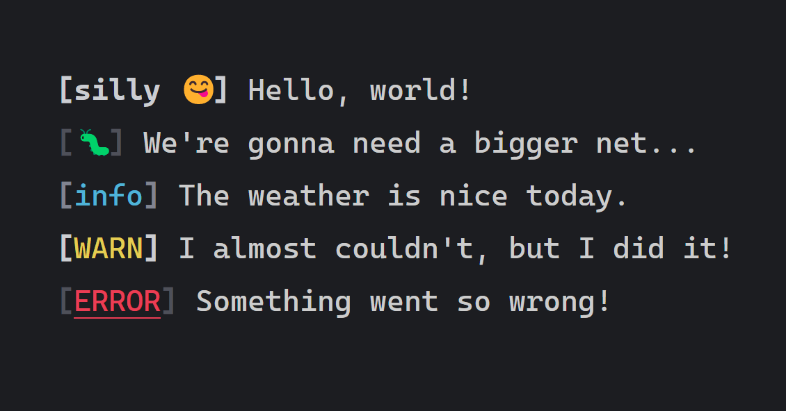
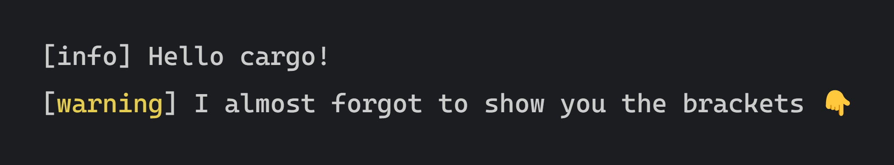
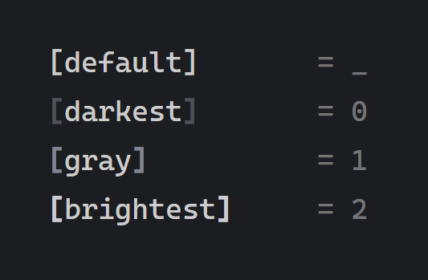
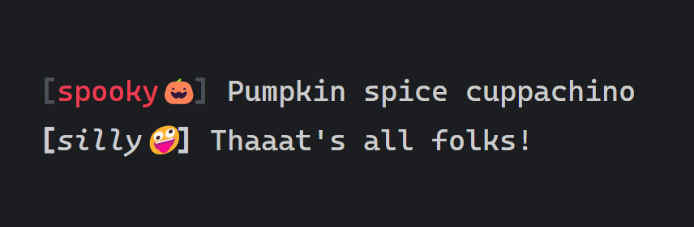

# Farve

🔗[docs.rs](https://docs.rs/crate/farve/latest) 
🔗[crates.io](https://crates.io/crates/farve)

A bite-sized *`macro_rules!`* wrapper around [`owo-colors`](https://github.com/jam1garner/owo-colors) for public-facing CLI applications.

```rust
use owo_colors::OwoColorize;
use farve::{efarve, farve};

//stdout
farve!(silly, "silly 😋".white().bold(), 2);
farve!(debug, '🐛', 0);
farve!(info, "info".blue(), 1);

// stderr
efarve!(warn, "WARN".bright_yellow(), 2);
efarve!(error, "ERROR".bright_red().underline(), 0);

fn main() {
    silly("Hello, world!");
    debug("We're gonna need a bigger net...");
    info("The weather is nice today.");
    warn("I almost couldn't, but I did it!");
    error("Something went so wrong!");
}
```



## Usage

Add `farve` to your `Cargo.toml`:

```apache
cargo add farve
```

## `farve!` and `efarve!`

```rust
use owo_colors::OwoColorize;
use farve::{efarve, farve};

farve!(info);
efarve!(warn, "warning".bright_yellow());

fn main() {
    info("Hello cargo!");
    warn("I almost forgot to show you the brackets 👇");
}
```



## `brackets`

The final parameter can be used to change the brightness of the brackets.

```rust
use farve::{brackets, farve};

fn main() {
    /// ->  [default]
    println!("{}", brackets!("default"));
    
    /// -> [darkest]
    println!("{}", brackets!("darkest", 0));
    
    /// -> [gray]
    println!("{}", brackets!("gray", 1));
    
    /// -> [brightest]
    println!("{}", brackets!("brightest", 2));
}
```



## `brackets!` can be used through `farve!` and `efarve!`

```rust
use farve::{farve, efarve};

farve!(spooky,"spooky🎃".red(), 0);
farve!(silly, "silly🤪".white().italic(), 2);
```


